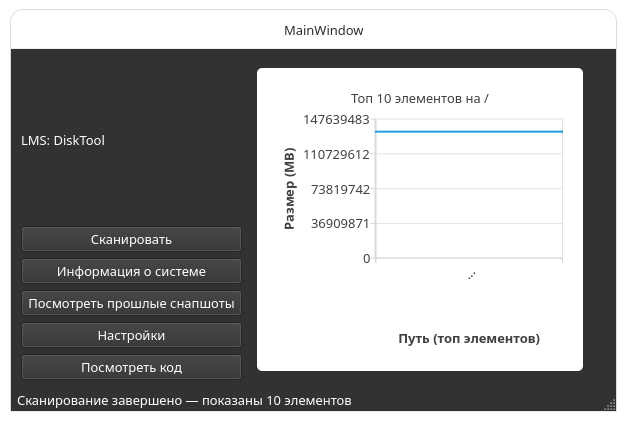

# Disk tool 
**Its QT6 based disk-scanner like [KDE Filelight](https://apps.kde.org/filelight/) avalible for all mainsream operating systems** 

> [!WARNING]
> Not released yet, now program in alpha state 

 

 
    

 

Disk usage info-graphic still in testing and works unstable. 
